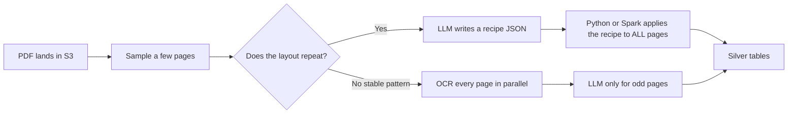
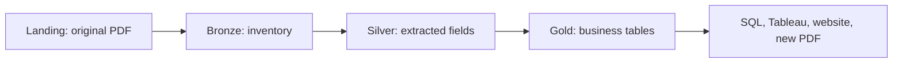
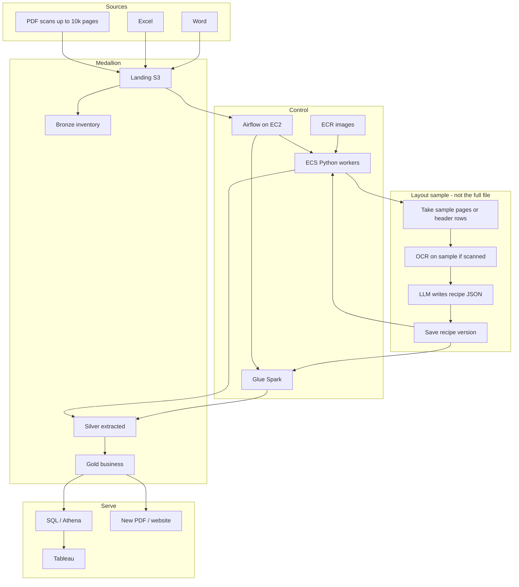
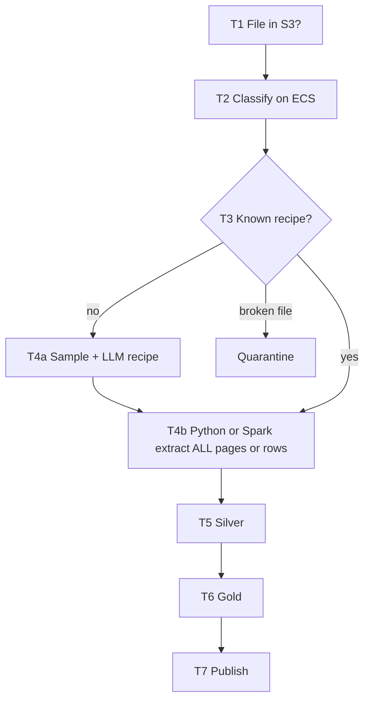

# Document Intelligence Lake — work trial

This repository is a **Senior Data Engineer / Data Architect assessment**. The candidate does **not** write a production system. They explain how they would design one, and why.

The `candidate/` folder is what you send the interviewee.  
`expected-solutions/` is the answer key. **Do not send it to the candidate.**

> ⚠️ **Keep this repository private.** `expected-solutions/` is only safe as long as candidates cannot browse this repo. Send candidates the zip below (or just the contents of `candidate/`), never a link to this repository.

---

## For the hiring client (plain language)

Imagine a company that receives **PDFs that are scans** (pictures of pages, not selectable text), plus Excel and Word. Some PDFs have **10,000 pages**. The business wants tables in a data lake so people can use **SQL, Tableau, or a clean new PDF** — not a folder of scans.

A junior answer is: “Give the whole PDF to an AI and let the AI write the database.”

That is **slow, expensive, and unsafe**. A senior answer splits the job:

1. **Save the file** as-is (so you never lose the original).
2. **Look at a small sample** of pages to see if the form **repeats**.
3. If it repeats, write a **recipe** (“invoice number is always in this box”).
4. A **normal program** (Python or Spark) applies that recipe to **all** pages, in parallel.
5. The AI does **not** load the warehouse. The program does.

We interview on **that judgment**, not on who types FastAPI the fastest.

---

## Why this trial is conceptual (not a coding homework)

| Coding test | This trial |
| --- | --- |
| “Build it in 8 hours” | “Explain the factory, the cost, and the failures” |
| Favors people who paste well from Copilot | Favors people who notice that 10,000 LLM calls would bankrupt the project |
| You see syntax | You see **critical thinking**: sample vs full read, who writes silver, Python vs Spark |
| Hard to compare across candidates | Same scenario, same questions, a written rubric |

Seniors still must know **how they would write the code**. We ask them to describe:

- Airflow **DAGs** with **docstrings** (what the DAG is for, owner, retries).
- Python **modules** with **imports**, small **helper** functions, and **docstrings** on each function.
- Which **libraries** they would use (for example PDF/OCR helpers vs Spark) and **why**.
- They do **not** have to ship a GitHub repo of working jobs in the interview.

If the role also needs “can ship careful Python under a time box,” that is a **different** exercise (the client’s anonymization coding trial). Do not mix both on the same day.

**How we run it:** Offline, at home. **8 hours**, then stop. Candidate: problem in `candidate/README.md`, tips `01_tips.md` … `05_tips.md`.

```bash
zip -r document-intelligence-lake-candidate.zip candidate
```

Attach that zip to the invite email. Do not attach or link this repository.

---

## One PDF, from the truck to the dashboard

Use this story with the client and with the candidate. Numbers are examples.

### Step 1 — The file arrives (landing)

A scanner or an upload puts `claim_pack.pdf` (10,000 pages, not selectable text) into an **S3** bucket we call **landing**.

Nothing is “in the database” yet. We keep the original forever. That is the legal copy.

**Airflow on EC2** notices the new object (a sensor). Airflow is a **calendar/to-do list**, not the worker that reads PDFs. The EC2 machine must **not** open 10,000 pages.

### Step 2 — What kind of file is this? (bronze inventory)

A small **Python** program in **ECS** (the image sat in **ECR**) looks at the file type: PDF vs Excel vs Word, page count, scanned or not. It writes a row of **metadata** (bronze). Still no business table.

### Step 3 — Do we need the AI to read everything?

**No — not if the packet is the same form repeated.**

Many 10,000-page files are: 20 pages of cover, then the **same layout** thousands of times (one claim form per few pages).

| Question | Cheap answer | Expensive answer |
| --- | --- | --- |
| How does the form look? | AI / document AI on a **sample**: first pages, some in the middle, last pages (tens of pages, not 10,000) | Send all 10,000 pages to an LLM |
| How do we read page 4,832? | A **script** follows the recipe from the sample | Ask the LLM again for every page |

**If there is no repeating pattern** (every page is a different letter), you cannot copy a recipe. Then you still should **not** use an LLM on every page as the default: use **OCR** (text-from-image) page by page in parallel, and call the LLM only when a page is unreadable or a new layout appears. That is slower and costs more — a senior says so out loud.



### Step 4 — Who writes silver: the LLM or a script?

**The script (or Spark job). Not the LLM.**

- The **LLM** output is a **recipe** (we also call it a contract): “field `claim_id` is in the header; the table has columns date, amount.”
- We store that recipe (versioned). We do **not** `exec()` Python the model invented.
- **Python on ECS** or **PySpark on Glue** reads pages (or Excel rows), applies the recipe, and **writes Parquet/Iceberg to silver**.

Think of the LLM as an architect who draws the floor plan. Think of Python/Spark as the crew that builds every floor. The architect does not lay every brick.

### Step 5 — What about Spark and 10,000 pages?

Spark does **not** magically turn a PDF into a spreadsheet.

We build a **list of work**: page 1–50, 51–100, …, 9951–10000. Each piece is a task:

- Airflow can **map** one ECS container per piece, **or**
- Spark can treat each page-range as a **partition** and run the same Python OCR+recipe function on each partition.

**We do not pass each page to the LLM in that loop.** The LLM already did its job on the sample. Each worker uses OCR + the recipe.

Excel is different: after the recipe says “headers are on row 5,” Spark reads **all rows** as data. No OCR.

### Step 6 — Gold, then people

Silver is “fields we pulled, still close to the file.”  
**Gold** is business tables (one row per claim, per line item).  
**Athena / Tableau / a new PDF** read gold. Analysts do **not** open the landing bucket of scans.



---

## Machines (simple map)

| Piece | Role in one sentence |
| --- | --- |
| S3 landing / bronze / silver / gold | Folders (buckets), each with its own IAM/KMS access rules |
| EC2 + Airflow | Starts jobs in order; does not scrape PDFs |
| ECR | Shelf of Python images |
| ECS | Runs those Python images (sample, OCR batches, Word) |
| Glue / Spark | Big Excel and big table transforms |
| LLM (e.g. on AWS Bedrock) | Recipe from a **sample** |
| OCR (e.g. Textract) | Turns a scanned **page** into text/boxes, in the extract loop |
| Glue Catalog + Athena | Makes gold queryable |

---

## Architecture (GitHub can render this)



Airflow DAG (same story as a to-do list):



---

## Folders

| Folder | Who |
| --- | --- |
| [candidate/](candidate/README.md) | Interviewee — files `01` … `05` |
| [expected-solutions/](expected-solutions/README.md) | Interviewer only |

Review & debrief guide: [expected-solutions/03_interview_facilitator_guide.md](expected-solutions/03_interview_facilitator_guide.md).  
Score: [expected-solutions/04_scoring_rubric.md](expected-solutions/04_scoring_rubric.md).  
Follow-up questions to test depth: [expected-solutions/06_defense_questions.md](expected-solutions/06_defense_questions.md).
