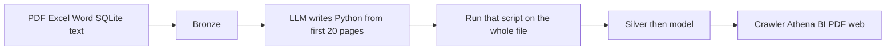

# The problem you must solve

This is an **architecture interview**, not a coding test. Do not write a production app, Dockerfile, or Terraform. You explain a design and **why**.

Live: 75–90 minutes. Take-home: 4–6 hours, then stop. After you understand this page, use [01_tips.md](01_tips.md) … [05_tips.md](05_tips.md) to raise the quality of your answer.

---

## What the business needs

A records company digitizes files for about **40 regulated customers**. Today the truth lives in files. Analysts and a customer portal must **query** that information and sometimes **reprint** it as a clean PDF.

### What arrives

| Source | Typical shape | Pain |
| --- | --- | --- |
| Scanned PDF | 50–10,000 **image** pages; often the same form after a cover | Cannot select text; layout may drift; tables span pages |
| Digital PDF | Real text, sometimes mixed scanned appendices | Do not OCR everything |
| Excel / CSV | Several sheets, merged headers, 10k–50M rows | pandas vs Spark |
| Word | Narrative + tables | Structure vs free text |
| SQLite | Tables, keys, blobs | Integrity; hard to split |
| Text / email | Encoding, long lines | Chunking |

The same business id (policy, shipment, person) can appear in more than one format in one batch.

### Size (use these unless you change them and say why)

- 2,000 documents/day; 8,000 at month-end  
- PDF: typical 40 pages; p95 800; p99 **10,000**  
- Mix: ~15% Excel, 5% Word, 2% SQLite, rest PDF/text  
- Keep raw files 7 years; silver/gold 3 years unless legal hold  
- Customer A must never see customer B  

### “Done” means

1. Every file is counted or quarantined with a reason. Nothing vanishes.
2. Fields are queryable in a data lake within an SLA **you** define.
3. Personal data is classified. Analysts do not browse the raw scans.
4. People can use SQL (Athena), Tableau or Power BI, a **new PDF** built from tables, and a website on governed data.
5. A half-finished run must not look like success.

---

## The team’s first idea (you must improve this)

```text
file → save to bronze
     → an LLM reads the first 20 pages and writes a Python script
     → that script runs on the whole file → silver
     → modeling
     → Glue crawler + Athena + Tableau + website + new PDF
```

Implied: one S3 bucket, `exec` of model-generated Python, one process for 10,000 pages, crawler as “the model,” everyone on one Athena workgroup.



Your job: **keep** the useful intent (layers, layout as a signal, AWS serving) and **replace** what is unsafe or will not scale.

You must orchestrate with **Apache Airflow on EC2**. Workers are **ECS** (Python images from **ECR**) and **Glue Spark**. Do not use Lambda to drive the pipeline. An **LLM** may help discover layout; it must not be the thing that loads 10,000 pages or writes the lake by itself.

---

## What to produce

- A spoken or written design: landing → how you find a layout → who scrapes all pages → silver → gold → SQL/BI/PDF.  
- How a **10,000-page scan** is sampled vs processed in full.  
- Who writes silver (LLM vs Python/Spark).  
- How you would structure **DAGs and Python helpers** (imports, docstrings) — describe them; do not ship a repo.

Tips to improve the answer: [01_tips.md](01_tips.md) (problem), [02_tips.md](02_tips.md) (naive design), [03_tips.md](03_tips.md) (rules), [04_tips.md](04_tips.md) (deep questions), [05_tips.md](05_tips.md) (take-home outline). Diagrams: [diagrams/](diagrams/).
