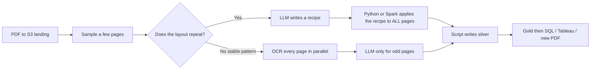
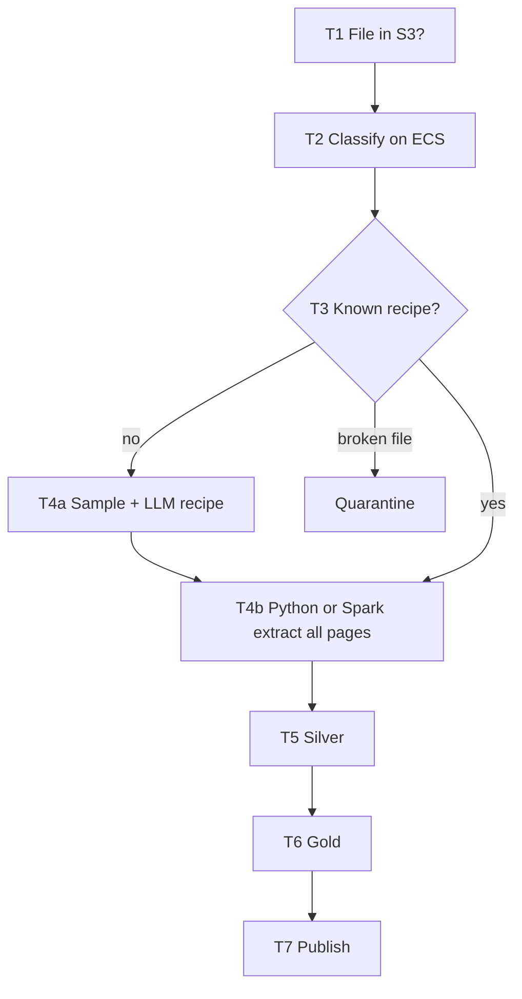

# Expected solutions — interviewer only

**Do not send this folder, or this repository, to the candidate.** Send only the public [document-intelligence-lake-candidate](https://github.com/arielmmdx/document-intelligence-lake-candidate) repo.

> ⚠️ This repository is public, same as the candidate one. Nothing technical stops a candidate from finding it if they go looking for the name — the only safeguard is that nobody ever hands them this link. `document-intelligence-lake-candidate` has its own git history with no trace this repo exists.

This page is the full explanation of the pipeline and of how we interview. Use it with the hiring client and as your own crib sheet.

---

## What this repo is

This is **not** software that runs. It is an assessment to see if someone is a **Senior Data Engineer / Data Architect**. They do not ship a product. They have to **think out loud** in their write-up.

---

## The business problem (one paragraph)

A company receives **scanned PDFs** (pictures of pages, not selectable text), plus Excel and Word. Some PDFs have **10,000 pages**. The business wants **tables**: SQL, Tableau, or a clean new PDF — not a folder of photos.

A weak answer: “Give the whole PDF to an AI and let the AI fill the database.”  
That is **slow, expensive, and unsafe**.

---

## One PDF, step by step

### 1. The file is saved (landing)

The scan or upload puts `claim_pack.pdf` into an **S3** bucket called **landing**. The original stays there. Nothing is “in the database” yet.

**Apache Airflow on EC2** notices the new object. Airflow is a **to-do list**. That EC2 machine **must not** open 10,000 pages.

### 2. What kind of file is this? (bronze)

A small **Python** program on **ECS** (image stored in **ECR**) checks: PDF vs Excel vs Word, page count, scanned or not. It writes **metadata** (bronze). Still no business table.

### 3. Does the AI have to read the whole PDF?

**No — if the packet is the same form repeated.**

Many 10,000-page files are a short cover, then the **same layout** thousands of times.

| Question | Cheap | Expensive |
| --- | --- | --- |
| How does the form look? | LLM / OCR on a **sample** (first pages, some in the middle, last pages — tens of pages, not 10,000) | Send all 10,000 pages to an LLM |
| How do we read page 4,832? | A **script** follows the recipe from the sample | Ask the LLM again for every page |

**If there is no repeating pattern** (every page is a different letter), you cannot copy a recipe. Then you still should **not** default to an LLM on every page: run **OCR in parallel** by page ranges, and call the LLM only when a page is unreadable or a new layout appears. A senior says the extra cost out loud.

Excel and Word use the same idea: sample the header or first tables → recipe → Spark or Python on the rest. Do **not** OCR Excel. Do **not** send every Excel row to an LLM.

### 4. Who writes silver — the LLM or a script?

**The script (Python or Spark). Not the LLM.**

- The LLM output is a **recipe** (JSON): “claim id sits here; the table has these columns.”
- We do **not** run Python the model invented (`exec`).
- **Python on ECS** or **PySpark on Glue** applies the recipe to all pages or rows and **writes Parquet/Iceberg to silver**.

The LLM is the architect of the floor plan. Python/Spark is the crew that builds every floor. The architect does not lay every brick.

### 5. Spark and 10,000 pages

Spark does **not** turn a PDF into a spreadsheet by magic.

We build a **list of work**: pages 1–50, 51–100, …, 9951–10000. Each piece is a task (Airflow mapped ECS **or** a Spark partition). Each worker: OCR + recipe. **The LLM is not in that loop.**

### 6. Gold, then people

Silver = fields pulled from the file.  
**Gold** = business tables (claim, line item).  
Athena / Tableau / a new PDF read **gold**. Analysts do not open the landing bucket of scans.

### Machines in one line

| Piece | Role |
| --- | --- |
| S3 landing / bronze / silver / gold | Separate folders, each with its own IAM/KMS access rules |
| EC2 + Airflow | Starts jobs; does not scrape PDFs |
| ECR | Shelf of Python images |
| ECS | Runs those images (sample, page batches, Word) |
| Glue / Spark | Big Excel and big table jobs |
| LLM | Recipe from a **sample** |
| OCR | Text from a scanned **page**, in the extract loop |
| Catalog + Athena | Makes gold queryable |

---

## Engineering practices to evaluate (conceptual, not code review)

They **describe** all of this out loud or in writing; nothing here is graded on syntax. Use it as a checklist while they talk — if a whole column never comes up, ask for it before scoring `04_scoring_rubric.md`.

### Python

- Modules split by responsibility (io / layout / extract), not one script.
- A `main()` (or an Airflow-safe task entrypoint) that gets called — no top-level code that runs on import.
- Docstring on every function: what it does, its inputs/outputs, why it exists — not the type hint restated in English.
- Imports actually named (`pypdf`/an OCR client vs `boto3` vs `pyspark`) and why each one, not "some PDF library."
- Errors distinguish retryable (S3 throttling) from fatal (corrupt file → quarantine); no silent `except: pass`.
- No hardcoded secrets, ARNs, or paths — config from env vars, Airflow Variables/Connections, or Secrets Manager.

### PySpark

- Explicit partition key for joins and writes (`tenant_id`, `document_id`) — not a default full shuffle.
- Never `.collect()` a full 50M-row DataFrame; aggregate or write from the workers.
- Schema declared/enforced on read, tied to `layout_version` — not re-inferred every run.
- Partition pruning / predicate pushdown when reading Parquet or Iceberg by date or tenant.
- Broadcast join named for the small recipe/dimension table joined against the big fact table.
- Skew and Adaptive Query Execution named as a real lever, not "Spark just handles it."

### Airflow DAGs

- Docstring at the top of the DAG file: purpose, owner, retry policy, SLA.
- Docstring on every task callable — same bar as the Python helpers.
- Idempotent and backfill-safe: the same logical run reproduces the same silver, not a duplicate.
- `retries`, `retry_delay`, and pools/concurrency limits named — not "retries: infinite."
- Task dependencies they can draw as a graph, not a 400-line linear script.
- Sensors (or event-driven trigger) vs. polling — how the DAG learns a file landed without a tight loop on the Airflow EC2.
- `catchup` behavior stated, and whether backfills are safe by design.
- Connections/Variables/Secrets Manager for credentials — never hardcoded in the DAG file.

### Logging & debugging

- Python `logging`, not `print`, with real levels: INFO for progress, WARNING for retryable, ERROR for quarantine.
- Every log line carries `tenant_id`, `file_id`/`run_id`, `layout_version` so one failure is traceable across ECS tasks.
- States explicitly what is **never** logged — OCR text, extracted PII (see `03_tips.md`).
- A concrete "how do I debug this at 3am" story — see `06_defense_questions.md` for follow-ups.

### Security & IAM

- SSO for human access (e.g. AWS IAM Identity Center) — no long-lived IAM users.
- MFA enforced for human sign-in, especially anyone who can touch landing or IAM.
- Distinct roles per actor — Airflow EC2, ECS task, Glue job, analyst — none of them the same role, least privilege on each.
- Task role ≠ the role used to build/deploy images (run-time and deploy-time privilege separated).
- KMS key per zone (landing/bronze/silver/gold), not one key for everything.
- No public S3 buckets or objects; account-level public-access block.

### Data catalog & Athena

- Tables registered in Glue Data Catalog (or equivalent) with a declared schema — not "the crawler will figure it out."
- PII columns classified/tagged (Lake Formation column-level tags, or a named equivalent).
- Athena workgroup(s) scoped per tenant or sensitivity tier, with query result location controlled — not one shared workgroup for everyone.
- Gold — never silver or landing — is what Athena, Tableau, and the website read from.
- Schema changes are additive/backward-compatible or explicitly versioned, so existing Athena queries do not silently break.

---

## Why we evaluate this way (not with a coding homework)

A senior shows up when they say: “we do not send 10,000 pages to the AI” and “the job writes silver, not the model.”

An 8-hour coding test measures typing and Copilot. This trial measures **critical thinking**: cost, who writes data, what must not run on the Airflow EC2.

We still ask **how** they would write code: helper modules, **imports**, **docstrings** on the DAG and on each function — they **describe** it; they do not deliver a working GitHub repo in the interview.

If the role also needs “can ship careful Python in a time box,” use the separate anonymization coding trial. Not the same day.

**How to run:** Offline, at home. 8 hours, then stop. Send the candidate the [document-intelligence-lake-candidate](https://github.com/arielmmdx/document-intelligence-lake-candidate) repo (problem in its `README.md`, then tips `01`–`05`). Never this repo.

Scoring: [04_scoring_rubric.md](04_scoring_rubric.md). Review & debrief guide: [03_interview_facilitator_guide.md](03_interview_facilitator_guide.md). Deeper notes: [01_expected_architecture.md](01_expected_architecture.md), [02_expected_interview_answers.md](02_expected_interview_answers.md). Push the candidate to defend a position: [06_defense_questions.md](06_defense_questions.md).
